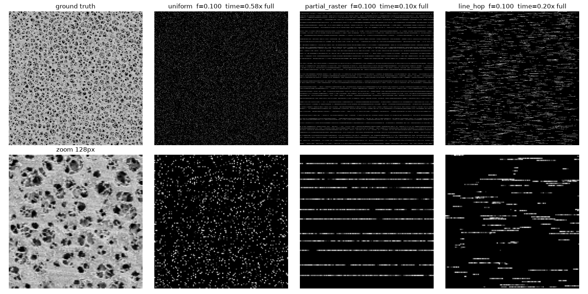
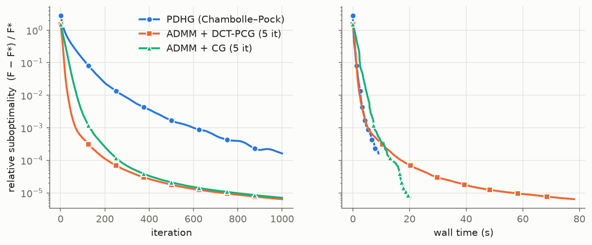

# Sparse-scan SEM reconstruction

A scanning electron microscope builds an image one pixel at a time. If the beam visits only 5–30% of the pixels, acquisition is faster and the specimen receives less dose. The missing pixels then have to be reconstructed.

This repo simulates that acquisition and compares classical and learned reconstructions on real SEM images.

What sets it apart from a generic inpainting benchmark:

- **Physically motivated measurements.** Shot noise is Poisson and scales with dwell time. Sampling patterns respect what scan coils can do: the beam cannot jump anywhere instantly, so full and partial raster lines are compared against the usual uniform-random pixels. A scan-time model charges for every settle and flyback, so methods are compared at equal *acquisition time* as well as at equal pixel count.
- **Classical solvers written from scratch.** Biharmonic interpolation uses its own sparse solve. TV inpainting has two solvers, Chambolle–Pock primal-dual and ADMM, and two data terms, least squares and the Poisson likelihood. All are checked against scikit-image.
- **Learned models.** A U-Net conditioned on the sampling mask is trained across fractions, patterns and doses. A conditional diffusion model is adapted from [diffusion-sparse-reconstruction-hpc](../diffusion-sparse-reconstruction-hpc).

> **Status:** code, tests and the evaluation protocol are complete. The full-scale runs (U-Net and diffusion training, the 100-image evaluation) are pending, so the result figures below come from `make_figures.py` once `results/metrics*.csv` exists. Only the pattern and convergence figures are committed now.

## Data

The dataset is **NFFA-Europe "100% SEM"** (Aversa et al., CNR-IOM): 21,169 SEM images at 1024×768 in 10 categories (particles, MEMS, nanowires, fibres, …).
- Licence: **CC-BY**. DOI [10.23728/b2share.80df8606fcdb4b2bae1656f0dc6db8ba](https://doi.org/10.23728/b2share.80df8606fcdb4b2bae1656f0dc6db8ba).
- Paper: R. Aversa, M. H. Modarres, S. Cozzini, R. Ciancio, A. Chiusole, *The first annotated set of scanning electron microscopy images for nanoscience*, Sci. Data 5, 180172 (2018).

Preprocessing (`semrecon/data.py`):
- Each image carries a Zeiss info banner whose top row ranges from about 608 to 676. It is detected per image, and only the rows above it are kept.
- Images are converted to grayscale in [0, 1].
- The split is 80/10/10 by image, stratified by category.
- Evaluation uses a frozen set of 512² test crops, one per image, drawn round-robin over categories.
- Masks and noise are never stored. They are regenerated from a seed per (image, pattern, fraction), so every method sees bit-identical inputs.

## Forward model

The clean image x ∈ [0, 1] is treated as the mean detected secondary-electron yield. A measured pixel with dwell time τ, at a beam giving Φ detected electrons per second at x = 1, records

$$n_i \sim \mathrm{Poisson}(D\,x_i),\qquad D = \Phi\tau,\qquad y_i = n_i / D ,$$

so E[y] = x and Var[y] = x/D. Unmeasured pixels are zero and flagged by the mask M.

There are two dose regimes (`semrecon/forward.py`):

| regime | per-pixel dose | question it answers |
|---|---|---|
| `fixed_dwell` (D = 20) | same D at every fraction | how much faster can we scan at the same pixel quality? |
| `fixed_dose` (D_full = 2) | D = D_full / f | at the same total specimen dose, is it better to measure fewer pixels more carefully? |

## Sampling patterns and scan time



The fast-scan direction runs along rows (`semrecon/patterns.py`). Each generator hits the requested fraction exactly:

- **uniform**: iid pixels. This is the standard inpainting setup. Physically, almost every pixel needs a blanked jump followed by coil settling.
- **partial raster**: a subset of full scan lines, one at a random offset within each of ⌈fH⌉ strata. There are no in-line jumps.
- **line-hop**: every line is scanned, but the beam dwells only on random-length segments and hops *forward* over the gaps. The coils never reverse mid-line. The segment count per line is k/16, and the lengths come from a uniform random composition.

The scan-time model is `t = N_pixels·τ + N_jumps·t_settle + N_lines·t_flyback`, with τ = 1 µs, t_settle = 5 µs and t_flyback = 50 µs.

This model changes the comparison substantially. At 10% of pixels, a uniform mask costs **0.58×** the time of a full raster, against 0.20× for line-hop and 0.10× for partial raster. At 20% uniform sampling, the time saving is gone entirely (0.99×).

## Methods

| method | where | notes |
|---|---|---|
| Biharmonic | `baselines/biharmonic.py` | Minimises ‖Lx‖² with x = y on M. L is the Neumann 5-point Laplacian. It solves (L²)_UU x_U = −(L²)_UK y_K with sparse LU. It interpolates exactly, so **shot noise passes straight through**. |
| TV-L2 | `baselines/tv.py` | λ·TV(x) + ½‖M(x−y)‖², with x ∈ [0,1] and isotropic TV. Solved with Chambolle–Pock and warm-started from a nearest-neighbour fill. |
| TV-Poisson | `baselines/tv.py` | λ·TV(x) + Σ_M (x − y log x), the Poisson negative log-likelihood. Same PDHG, using the closed-form KL prox x = ½[(v−τ) + √((v−τ)² + 4τy)]. |
| U-Net | `models/unet.py` | 7.8M parameters. Input is [zero-filled y, M]. It predicts a residual on top of a normalized-convolution fill. One model covers every f ∈ [5%, 30%], pattern, dose and regime. Loss is L1 + 0.2·(1−SSIM). |
| U-Net (uniform-only) | same | Ablation: trained on uniform masks only, then tested on all patterns. |
| Diffusion | `models/diffusion.py` | Ported from the ERA5 project. Conditioned by concatenating (x_t, y, M). Observations are made consistent RePaint-style: they are noised to the current step, replacing the old clean-y substitution. The output is an ensemble mean with a std map. |

TV's λ is grid-searched per (regime, pattern, fraction) on the **validation** crops only (`results/tv_lambdas.json`).

### TV solvers: PDHG vs ADMM



This is TV-L2 on a 256² crop with 10% line-hop sampling. Suboptimality is measured against a 20k-iteration reference.

- **Per iteration**, ADMM converges far faster than PDHG.
- **Per wall-clock second**, the ranking changes. The x-update needs an inner CG solve of (M + ρ∇ᵀ∇)x = b, because the mask stops any fast transform from diagonalising it.
- **The DCT preconditioner** replaces M by its mean f, which makes the system exactly diagonal in the DCT-II basis. It helps only a little per iteration and costs about 6× the time per iteration. With structured masks, f·I is a poor stand-in for M.
- **In practice**, plain-CG ADMM and PDHG are both adequate. PDHG, warm-started, settles in about 100 iterations; from a zero start it takes more than 1000, because TV only spreads information into a gap about one pixel per iteration.

## Results

`python scripts/make_figures.py` writes the following to `results/figures/`, and writes `results/summary.md`:

- `psnr_vs_frac_<regime>.png`, `ssim_vs_frac_<regime>.png` and `psnr_unobserved_vs_frac_<regime>.png`: one panel per pattern, one line per method, with 95% bootstrap CIs over images.
- `psnr_vs_time_<regime>.png`: PSNR against relative scan time, which is the comparison that matters to a microscopist.
- `qualitative_*.png`: ground truth, the measurement, and every method's output on one crop.

Early observations from a 3-image smoke run (not final numbers):
- TV beats biharmonic by 3–6 dB at dose 20, because biharmonic reproduces the noise.
- Biharmonic's PSNR doesn't improve with more partial-raster lines, because each extra line adds noise it can't remove.

*(Full tables are pasted here from `results/summary.md` after the evaluation runs.)*

## What this simulation ignores

- **Scan-coil dynamics.** Hysteresis, overshoot and settling transients are reduced to one constant settle time per jump. Real line-hop scans would show position errors at the start of each segment, and those errors depend on the jump length.
- **Drift.** Stage and beam drift between lines, and over a long acquisition, are absent. Sparse scans taken quickly suffer *less* drift than a full raster, an advantage this simulation does not credit.
- **Charging and beam damage.** Insulating specimens charge nonuniformly, and the charging depends on scan order and dwell. That changes contrast and can deflect the beam. The fixed-dose regime counts total dose, but it does not model damage or charging.
- **Detector response.** The model omits:
  - SE-yield statistics beyond Poisson, such as the excess noise of the SE cascade and scintillator/PMT gain variance;
  - detector bandwidth and the resulting blur along the scan;
  - the beam's point-spread function;
  - quantisation, and offset/gain drift.
- **Ground truth is not truth.** The "clean" images are themselves noisy, JPEG-compressed acquisitions. Metrics measure agreement with another noisy image, and the learned models partly learn JPEG artifacts.

## Reproduce

```bash
uv venv && uv pip install -e ".[dev]"      # add --extra-index-url https://download.pytorch.org/whl/cpu for CPU torch
pytest -q                                   # forward model, patterns, solvers vs skimage, U-Net, diffusion

python scripts/prepare_data.py --root data/nffa         # ~13.5 GB download + splits + frozen eval crops
python scripts/evaluate.py                               # tune TV lambda on val, run classical methods (CPU, multiprocess)
python scripts/train_unet.py --config configs/unet.yaml  # GPU
python scripts/evaluate.py --stage eval --methods unet --unet-ckpt checkpoints/unet/best.pt --device cuda
python scripts/make_figures.py --unet-ckpt checkpoints/unet/best.pt
```

- **Colab:** `colab/train.ipynb` keeps the dataset tars and checkpoints on Drive, extracts to local disk each session, trains, and evaluates.
- **SLURM:** `hpc/sbatch_train_*.sh`.

## Layout

```
src/semrecon/  data, forward, patterns, metrics, evaluate, plots, train_unet, train_diffusion
               baselines/{biharmonic,tv}.py   models/{unet,diffusion}.py
scripts/       prepare_data, show_patterns, train_*, evaluate, make_figures
configs/       eval.yaml, unet.yaml, diffusion.yaml, *smoke.yaml
colab/ hpc/ tests/
```
