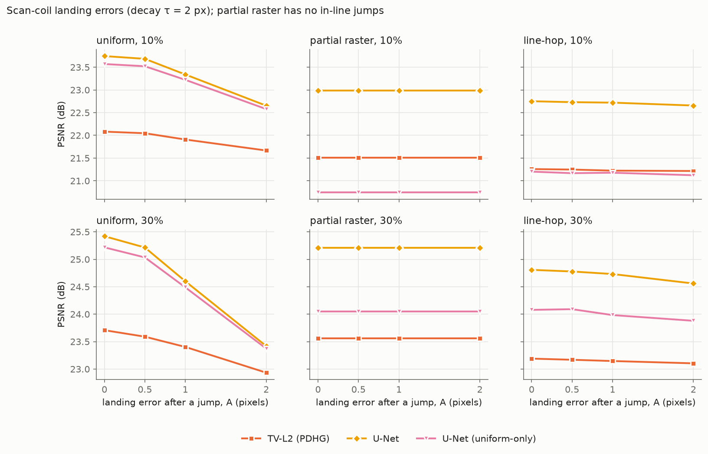
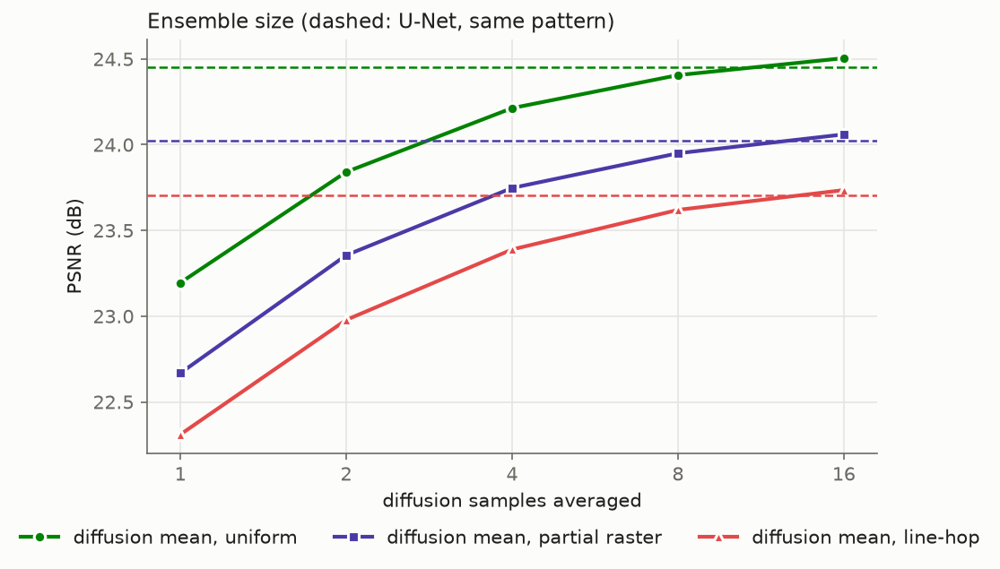
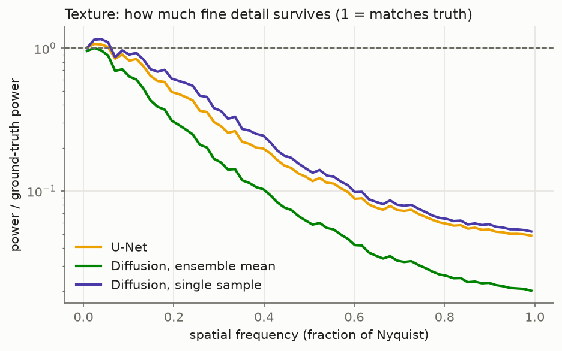
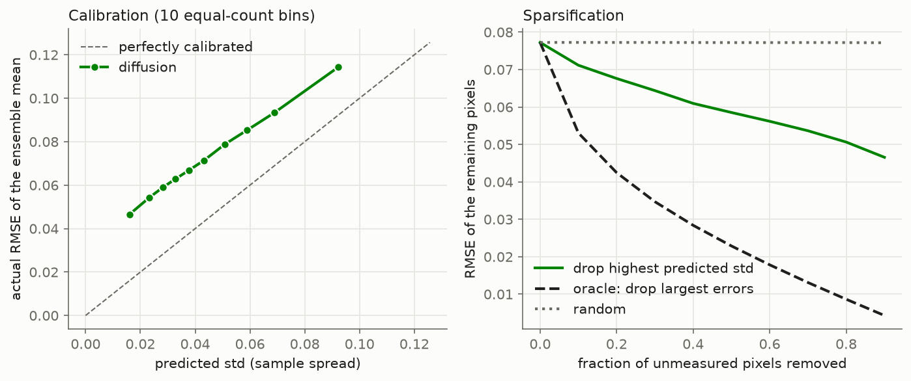
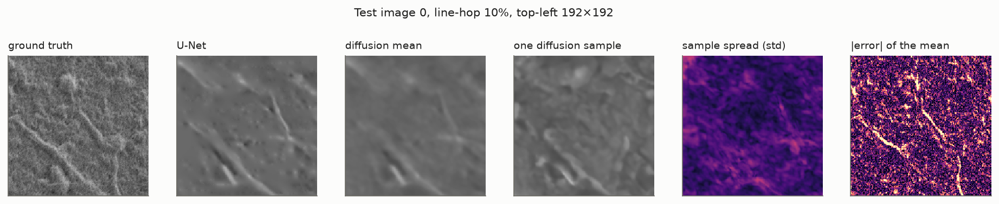
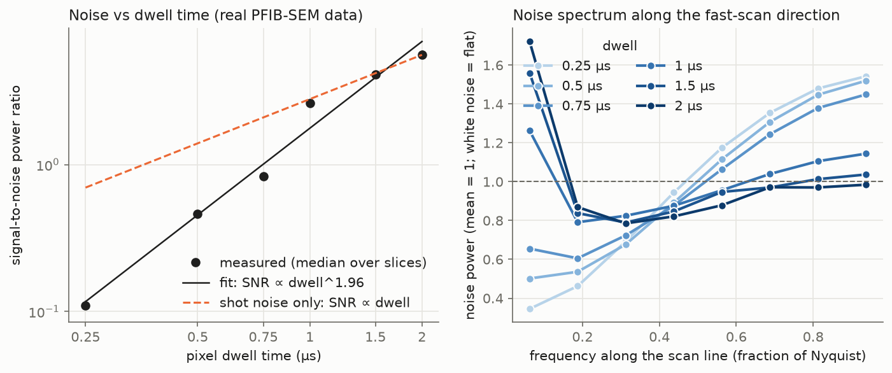
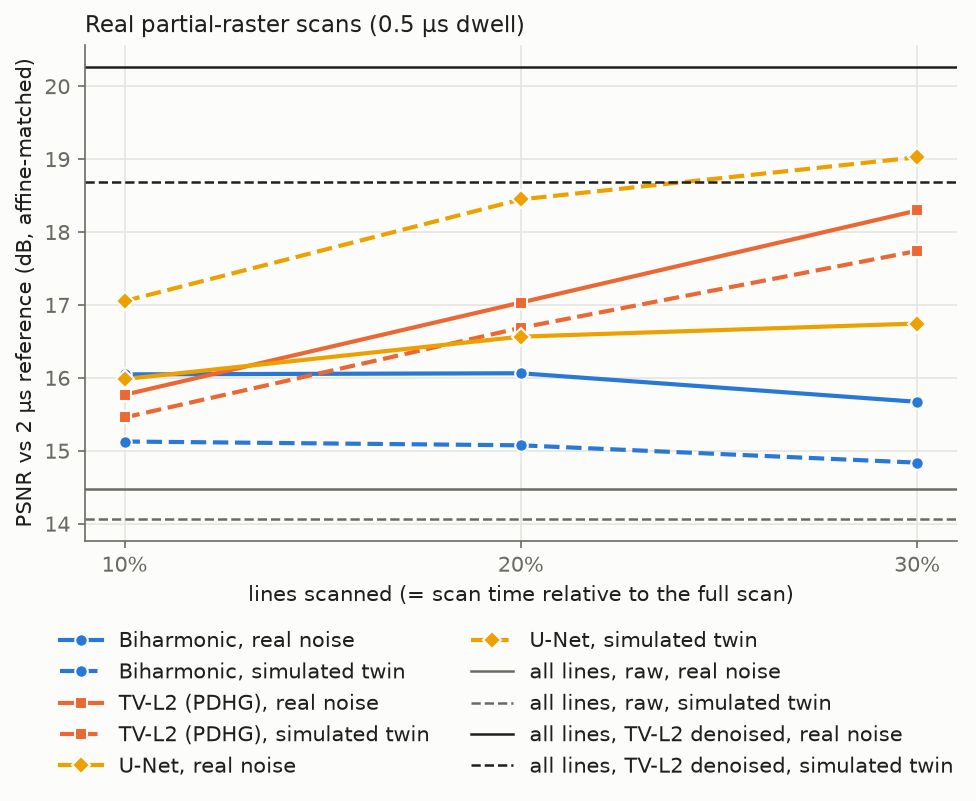
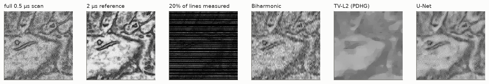
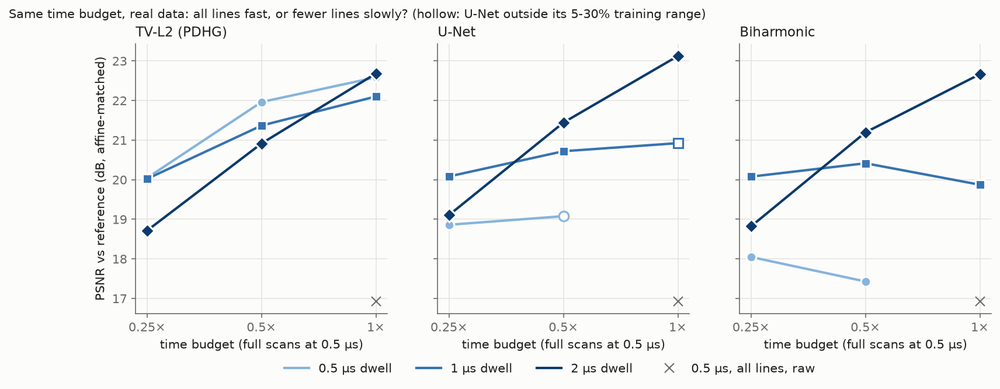
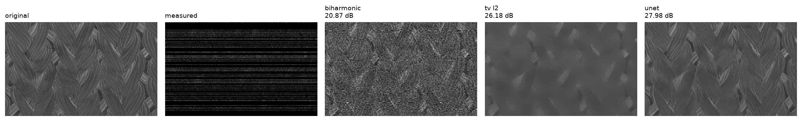

# Sparse-scan SEM reconstruction

[](https://github.com/CameronGordonn/sparse-scan-SEM-reconstruction/actions/workflows/ci.yml)

A scanning electron microscope builds an image one pixel at a time. If the beam visits only 5–30% of the pixels, acquisition is faster and the specimen receives less dose. The missing pixels then have to be reconstructed.

**New to the topic?** [`docs/results-explained.pdf`](docs/results-explained.pdf) walks through the study and its findings in plain language, with the key figures.

This repo simulates that acquisition and compares classical and learned reconstructions on real SEM images.

What sets it apart from a generic inpainting benchmark:

- **Physically motivated measurements.** Shot noise is Poisson and scales with dwell time. Sampling patterns respect what scan coils can do: the beam cannot jump anywhere instantly, so full and partial raster lines are compared against the usual uniform-random pixels. A scan-time model charges for every settle and flyback, so methods are compared at equal *acquisition time* as well as at equal pixel count.
- **Classical solvers written from scratch.** Biharmonic interpolation uses its own sparse solve. TV inpainting has two solvers, Chambolle–Pock primal-dual and ADMM, and two data terms, least squares and the Poisson likelihood. All are checked against scikit-image.
- **Checked on real scans.** Real partial-raster scans from a PFIB-SEM test the noise model and the models' transfer (see [Real SEM data](#real-sem-data)).
- **Learned models.** A U-Net conditioned on the sampling mask is trained across fractions, patterns and doses. A conditional diffusion model is adapted from [diffusion-sparse-reconstruction-hpc](https://github.com/CameronGordonn/diffusion-sparse-reconstruction-hpc).

## Data

The dataset is **NFFA-Europe "100% SEM"** (Aversa et al., CNR-IOM): 21,169 SEM images at 1024×768 in 10 categories (particles, MEMS, nanowires, fibres, …).
- Licence: **CC-BY**. DOI [10.23728/b2share.80df8606fcdb4b2bae1656f0dc6db8ba](https://doi.org/10.23728/b2share.80df8606fcdb4b2bae1656f0dc6db8ba).
- Paper: R. Aversa, M. H. Modarres, S. Cozzini, R. Ciancio, A. Chiusole, *The first annotated set of scanning electron microscopy images for nanoscience*, Sci. Data 5, 180172 (2018).

Preprocessing (`semrecon/data.py`):
- The roughly 230 larger images (2048 or 3072 wide) are resized to 1024 wide so the pixel scale is comparable.
- Most images carry a Zeiss info banner starting at rows 580–690, and about 2% have none. The banner is detected per image as the first nearly all-white row at or below row 570, which avoids false positives from white specimen backgrounds. Only the rows above it are kept.
- Images are converted to grayscale in [0, 1].
- The split is 80/10/10 by image, stratified by category.
- Evaluation uses a frozen set of 512² test crops, one per image, drawn round-robin over categories.
- Masks and noise are never stored. They are regenerated from a seed per (image, pattern, fraction), so every method sees bit-identical inputs.

## Forward model

The clean image x ∈ [0, 1] is treated as the mean detected secondary-electron yield. A measured pixel with dwell time τ, at a beam giving Φ detected electrons per second at x = 1, records

$$n_i \sim \mathrm{Poisson}(D\,x_i),\qquad D = \Phi\tau,\qquad y_i = n_i / D ,$$

so E[y] = x and Var[y] = x/D. Unmeasured pixels are zero and flagged by the mask M.

There are two dose regimes (`semrecon/forward.py`):

| regime | per-pixel dose | question it answers |
|---|---|---|
| `fixed_dwell` (D = 20) | same D at every fraction | how much faster can we scan at the same pixel quality? |
| `fixed_dose` (D_full = 2) | D = D_full / f | at the same total specimen dose, is it better to measure fewer pixels more carefully? |

## Sampling patterns and scan time


The fast-scan direction runs along rows (`semrecon/patterns.py`). Each generator hits the requested fraction exactly:

- **uniform**: iid pixels. This is the standard inpainting setup. Physically, almost every pixel needs a blanked jump followed by coil settling.
- **partial raster**: a subset of full scan lines, one at a random offset within each of ⌈fH⌉ strata. There are no in-line jumps.
- **line-hop**: every line is scanned, but the beam dwells only on random-length segments and hops *forward* over the gaps. The coils never reverse mid-line. The segment count per line is k/16, and the lengths come from a uniform random composition.

The scan-time model is `t = N_pixels·τ + N_jumps·t_settle + N_lines·t_flyback`, with τ = 1 µs, t_settle = 5 µs and t_flyback = 50 µs.

This model changes the comparison substantially. At 10% of pixels, a uniform mask costs **0.58×** the time of a full raster, against 0.20× for line-hop and 0.10× for partial raster. At 20% uniform sampling, the time saving is gone entirely (0.99×).

## Methods

| method | where | notes |
|---|---|---|
| Biharmonic | `baselines/biharmonic.py` | Minimises ‖Lx‖² with x = y on M. L is the Neumann 5-point Laplacian. It solves (L²)_UU x_U = −(L²)_UK y_K with sparse LU. It interpolates exactly, so **shot noise passes straight through**. |
| TV-L2 | `baselines/tv.py` | λ·TV(x) + ½‖M(x−y)‖², with x ∈ [0,1] and isotropic TV. Solved with Chambolle–Pock and warm-started from a nearest-neighbour fill. |
| TV-Poisson | `baselines/tv.py` | λ·TV(x) + Σ_M (x − y log x), the Poisson negative log-likelihood. Same PDHG, using the closed-form KL prox x = ½[(v−τ) + √((v−τ)² + 4τy)]. |
| U-Net | `models/unet.py` | 7.8M parameters. Input is [zero-filled y, M]. It predicts a residual on top of a normalized-convolution fill. One model covers every f ∈ [5%, 30%], pattern, dose and regime. Loss is L1 + 0.2·(1−SSIM). |
| U-Net (uniform-only) | same | Ablation: trained on uniform masks only, then tested on all patterns. |
| Diffusion | `models/diffusion.py` | Ported from the ERA5 project (7.9M parameters). Conditioned by concatenating (x_t, y, M), with the time embedding in every block. Masks are drawn per example, and one model covers all fractions and patterns. Two ᾱ off-by-one bugs from the original are fixed. The consistency mode is chosen on val from three: `none` (pure conditional sampling), `repaint` (observations noised to the current step) and `hard` (the original clean-y paste). The Poisson-noisy y makes pasting the observations a real trade-off. The output is the mean of a 4-sample DDIM ensemble with a std map. |

TV's λ is grid-searched per (regime, pattern, fraction) on the **validation** crops only (`results/tv_lambdas.json`), over 0.0015–1.6 in factors of two. The grid originally stopped at 0.4. At fixed dose, TV-Poisson picked 0.4 in 7 of 15 cases, so the grid was extended. Only line-hop at 30% then moved (to 0.8), and those rows were re-evaluated. No other choice lies on the grid edge.

### TV solvers: PDHG vs ADMM


This is TV-L2 on a 256² crop with 10% line-hop sampling. Suboptimality is measured against a 20k-iteration reference.

- **Per iteration**, ADMM converges far faster than PDHG.
- **Per wall-clock second**, the ranking changes. The x-update needs an inner CG solve of (M + ρ∇ᵀ∇)x = b, because the mask stops any fast transform from diagonalising it.
- **The DCT preconditioner** replaces M by its mean f, which makes the system exactly diagonal in the DCT-II basis. It helps only a little per iteration and costs about twice the time per iteration of plain CG. With structured masks, f·I is a poor stand-in for M.
- **In practice**, plain-CG ADMM and PDHG are both adequate. PDHG, warm-started, settles in about 100 iterations; from a zero start it takes more than 1000, because TV only spreads information into a gap about one pixel per iteration.

## Results

**Setup.**
- **Test set:** every method sees the same 100 frozen 512² test crops.
- **Cases:** 3 patterns × 5 fractions × 2 dose regimes, so 30 cases per image and 3,000 reconstructions per method. Masks and noise are identical across methods.
- **Training:** on one A100.
  - U-Net: 60k steps.
  - Uniform-only ablation: 30k steps.
  - Diffusion: 150k steps.
- **Diffusion sampler:** chosen on val. Pure conditional sampling (`none`) scored 23.08 dB, against 18.08 for `repaint` and 17.78 for `hard`.
- **Classical methods:** run on CPU.

Raw rows are in `results/metrics*.csv`.

### Mean over all fractions

PSNR in dB by sampling pattern; SSIM is averaged over all cases.

| method | fixed dwell: uniform | partial raster | line-hop | SSIM | fixed dose: uniform | partial raster | line-hop | SSIM |
|---|---|---|---|---|---|---|---|---|
| Biharmonic | 18.03 | 19.66 | 16.75 | 0.27 | 16.87 | 18.41 | 15.65 | 0.24 |
| TV-L2 | 24.05 | 23.53 | 23.21 | 0.48 | 23.72 | 23.15 | 22.84 | 0.47 |
| TV-Poisson | 23.70 | 23.25 | 22.90 | 0.46 | 23.26 | 22.74 | 22.55 | 0.44 |
| U-Net (uniform-only) | 25.90 | 22.79 | 23.53 | 0.51 | 25.49 | 21.99 | 22.84 | 0.48 |
| **U-Net** | **26.11** | **25.48** | **25.22** | **0.58** | **25.71** | **25.09** | **24.88** | **0.57** |
| Diffusion | 25.79 | 25.08 | 24.83 | 0.55 | 25.36 | 24.64 | 24.46 | 0.54 |

### At 10% sampling

At f = 10% the two regimes coincide, since D = 2 / 0.1 = 20. The ± values are 95% bootstrap half-widths over images. They are mostly image-to-image variation; the paired differences below are much tighter. `results/summary.md` has the SSIM version.

| method | uniform | partial raster | line-hop |
|---|---|---|---|
| Biharmonic | 17.91 ± 0.46 | 19.96 ± 0.61 | 16.27 ± 0.48 |
| TV-L2 | 23.51 ± 1.02 | 22.77 ± 1.02 | 22.47 ± 0.99 |
| TV-Poisson | 23.16 ± 0.92 | 22.59 ± 1.02 | 22.24 ± 1.01 |
| U-Net (uniform-only) | 25.45 ± 1.15 | 21.59 ± 0.88 | 22.40 ± 1.02 |
| **U-Net** | **25.67 ± 1.16** | **24.83 ± 1.20** | **24.61 ± 1.21** |
| Diffusion | 25.30 ± 1.17 | 24.41 ± 1.20 | 24.18 ± 1.20 |

### Paired differences

Each image's PSNR difference is averaged over its cases. The interval is a 95% bootstrap CI over the 100 images.

| comparison | fixed dwell | fixed dose | first method better on |
|---|---|---|---|
| U-Net − TV-L2 | +2.01 [1.78, 2.25] | +1.99 [1.76, 2.24] | 99% of images |
| U-Net − Diffusion | +0.37 [0.33, 0.42] | +0.41 [0.36, 0.45] | 98–99% |
| Diffusion − TV-L2 | +1.64 [1.42, 1.87] | +1.58 [1.37, 1.83] | 98% |
| TV-L2 − TV-Poisson | +0.31 [0.18, 0.45] | +0.39 [0.26, 0.53] | 71–83% |
| U-Net − uniform-only, partial raster | +2.69 [2.26, 3.18] | +3.10 [2.61, 3.63] | 100% |
| U-Net − uniform-only, line-hop | +1.69 [1.40, 2.02] | +2.04 [1.66, 2.46] | 100% |


### Equal scan time

A microscopist cares less about the pixel fraction than about acquisition time. For each method, this is the best PSNR reachable within a scan-time budget, taking the best of the 15 (pattern, fraction) configurations that fit.


| method (fixed dwell) | ≤ 0.1× | ≤ 0.2× | ≤ 0.3× | ≤ 1× |
|---|---|---|---|---|
| Biharmonic | 20.11 (raster 5%) | 20.11 (raster 5%) | 20.11 (raster 5%) | 20.11 (raster 5%) |
| TV-L2 | 22.77 (raster 10%) | 24.27 (raster 20%) | 25.21 (raster 30%) | 25.21 (raster 30%) |
| TV-Poisson | 22.59 (raster 10%) | 23.97 (raster 20%) | 24.64 (raster 30%) | 24.64 (raster 30%) |
| U-Net (uniform-only) | 21.59 (raster 10%) | 23.61 (raster 20%) | 25.47 (raster 30%) | 26.48 (uniform 20%) |
| **U-Net** | **24.83 (raster 10%)** | **26.32 (raster 20%)** | **27.08 (raster 30%)** | **27.08 (raster 30%)** |
| Diffusion | 24.41 (raster 10%) | 26.02 (raster 20%) | 26.85 (raster 30%) | 26.85 (raster 30%) |

- **Partial raster is the right choice at every budget up to a full raster, for every method except the uniform-only ablation.** Biharmonic stays at 5%, because more lines only add noise it can't remove.
- **Past 0.3×, extra time buys almost nothing.** Up to a full raster's time, nothing beats raster at 30%. Only uniform at 30% edges past it, by 0.2 dB, and it takes 1.31×: longer than scanning every pixel.
- **The uniform-only U-Net is the exception:** from about 0.8× it is best with uniform masks, the only kind it was trained on.
- **Fixed dose:** partial raster is again the frontier for the U-Net, diffusion and TV-L2. TV-Poisson and the ablation switch to uniform at 5% once the budget reaches 0.34×. `results/summary.md` has the fixed-dose table and each configuration's exact time. `psnr_vs_time_<regime>.png` shows every pattern's curve per method.

### By specimen category


Each category has 10 test images. The ordering holds in all 10 categories and both regimes: U-Net, then diffusion, then the best classical method.
- **Hardest categories:** fine, dense textures such as porous sponge and coated films (U-Net about 21 dB).
- **Easiest categories:** isolated objects on smooth backgrounds, such as tips and particles (about 30 dB).
- **Where the U-Net gains most over TV-L2:** on fibres, +3.2 dB [2.5, 3.9]; the gain is smallest on biological specimens, +1.2 dB [0.9, 1.5]. The table with paired CIs is in `results/summary.md`.

### Scan-coil position errors

The main evaluation assumes the beam lands exactly where it is sent. Real deflection coils overshoot after a blanked jump and settle over a few pixels. This is a **sensitivity analysis**, not a calibrated model: no measured coil data was available.

**The model** (`semrecon/coils.py`):
- After every blanked in-line jump, the beam lands displaced along the scan line by e_k = A·exp(−k/τ) for the k-th pixel of the segment, with τ = 2 px.
- The first segment of each line follows the flyback and is assumed settled.
- The detector records the image at the displaced position, but the value is filed under the nominal pixel.

**What each pattern sees:**
- partial raster has no in-line jumps, so it is unaffected by construction;
- line-hop is shifted only at the start of each segment;
- uniform sampling starts almost every pixel with a jump.

**The run:** A = 0, 0.5, 1 and 2 px, on the first 30 test images at 10% and 30% sampling (fixed dwell), with the existing models; nothing is retrained. At A = 0 the measurements are bit-identical to the main evaluation.



| U-Net PSNR (dB) | A = 0 | A = 1 | A = 2 |
|---|---|---|---|
| uniform 10% | 23.74 | 23.33 | 22.65 |
| partial raster 10% | 22.99 | 22.99 | 22.99 |
| line-hop 10% | 22.75 | 22.72 | 22.66 |
| uniform 30% | 25.42 | 24.60 | 23.42 |
| partial raster 30% | 25.21 | 25.21 | 25.21 |
| line-hop 30% | 24.81 | 24.73 | 24.56 |

- **Uniform sampling degrades steadily with the landing error, and its advantage at equal pixel count disappears.**
  - At A = 2 px the U-Net loses 1.1 dB at 10% and 2.0 dB at 30%.
  - Uniform's lead over partial raster at the same fraction, 0.75 dB at 10% and 0.21 dB at 30%, turns into a deficit. Uniform falls behind somewhere between A = 1 and 2 px at 10%, and at about 0.5 px at 30%.
  - At equal scan time, uniform was already far behind; this widens the gap.
- **Line-hop barely notices:** at most −0.25 dB at A = 2 px, because only the first couple of pixels of each segment are off.
- **The learned models are more sensitive than TV:** the U-Net loses 2.0 dB on uniform 30% at A = 2 px, where TV-L2 loses 0.8 dB. The uniform-only U-Net behaves like the U-Net. Both were trained on perfectly registered data and rely on fine detail that misregistration corrupts. Training with simulated landing errors would be the natural fix; it wasn't tried here.

`results/jitter/summary.md` has all three methods; the raw rows are in `results/jitter/metrics_*.csv`.

### What diffusion offers beyond PSNR

PSNR rewards the conditional mean, which the U-Net predicts directly, so the main tables can't show what a sampler adds. `scripts/diffusion_analysis.py` draws **16 samples** per case on the first 20 test images. Each image is run for all three patterns at 10% and 30% (fixed dwell), 120 cases in all. From those samples it measures three things:
- PSNR as a function of how many samples are averaged;
- how much real texture survives, as power in the 0.15–0.5 × Nyquist band relative to the ground truth, plus LPIPS;
- whether the spread across samples predicts where the mean is wrong.



| | U-Net | diffusion, 1 sample | 4-sample mean | 16-sample mean |
|---|---|---|---|---|
| PSNR (dB) | 24.06 | 22.72 | 23.78 | 24.10 |
| mid-band texture power (1 = truth) | 0.53 | 0.62 | — | 0.38 |
| LPIPS (lower is closer) | 0.427 | 0.482 | — | 0.546 |

- **Averaging 16 samples closes the PSNR gap to the U-Net entirely.** The difference is +0.04 dB, with a paired 95% CI over images of [−0.06, +0.16], so it's a statistical tie. The 16-sample mean is slightly ahead at 30% sampling (25.20 vs 25.04 dB) and slightly behind at 10% (23.00 vs 23.08). The 4-sample mean used in the main evaluation trails by 0.28 dB [0.17, 0.36]. The tie costs 16 × 100 network evaluations, about 19 s per crop on an A100, against 0.03 s for the U-Net.
- **A single sample keeps more fine structure than the U-Net, but not the right structure.** It keeps 0.62 of the true mid-band power against 0.53, more on 75% of images, and averaging washes that out to 0.38. But its LPIPS is still worse than the U-Net's, which is perceptually closer on 65% of images. The extra texture is plausible, not faithful. A single sample does beat the ensemble mean on LPIPS for every image.



- **The sample spread is a weak but real error map, and it's overconfident.**
  - Rank correlation between per-pixel std and |error| on unmeasured pixels is 0.29.
  - Discarding the most uncertain pixels removes about 35% of what an oracle that knows the errors would remove: AUSE 0.028, against 0.043 for a random ranking.
  - The spread under-states the actual error by about 1.7× (mean std 0.045 vs RMSE 0.077), consistently across the calibration bins. Part of the gap is the reference's own shot noise and JPEG grain, which no reconstruction can predict. The |error| panel below is dominated by it.




`results/diffusion_analysis/summary.md` has the per-pattern tables, and `cases.csv` the per-case values.

### Findings

- **The U-Net is best in every one of the 30 cases, in both regimes.**
  - It gains about 2 dB over the best classical method, TV-L2, and is better on 99% of individual images.
  - It is also by far the fastest: 0.03 s per 512² crop on an A100, against about 12 s for TV in one CPU worker process.
- **Diffusion comes second, but it doesn't beat the direct regressor on these metrics.**
  - It trails the U-Net by 0.37–0.41 dB and is worse on 98–99% of images.
  - It takes 4.8 s per crop: 4 samples × 100 DDIM steps.
  - PSNR and SSIM reward the conditional mean, which is exactly what the U-Net is trained to predict. A 4-sample ensemble mean only approaches it; averaging 16 samples ties it, at 4× the cost again (see *What diffusion offers beyond PSNR*).
  - Enforcing the measurements during sampling hurts badly, by about 5 dB on val. The observations carry Poisson noise, so pasting them back in, clean or re-noised, injects that noise.
- **Training on scan-feasible patterns matters.**
  - The uniform-only ablation nearly matches the U-Net on uniform masks, trailing by only 0.2 dB.
  - It loses 1.7–3.1 dB on partial raster and line-hop, and falls below TV-L2 on partial raster.
  - In the qualitative panel it invents streak texture along the line-hop segments.
- **At equal scan time, contiguous sampling wins by a wide margin.** Scan time here is relative to a full raster, from the settle and flyback model.
  - In the fixed-dwell regime, partial raster at 30% (0.30× the raster time) beats uniform at 5% (0.34×) for every method: U-Net 27.08 vs 24.64 dB, TV-L2 25.21 vs 22.70 dB.
  - Uniform sampling spends most of its time on coil settling.
  - At fixed dose the margin shrinks, to +0.6 dB for the U-Net and +0.7 dB for diffusion. It reverses for biharmonic, TV-Poisson and the uniform-only U-Net, because those 30% of pixels carry only 6.7 counts each.
- **At a fixed total dose, only methods that denoise benefit from spreading it over more pixels.**
  - As f goes from 5% to 30%, the U-Net improves from 24.25 to 25.82 dB and TV-L2 from 22.78 to 23.83 dB.
  - Biharmonic falls from 19.07 to 14.59 dB, because it interpolates the noise exactly.
  - The learned models' gains flatten beyond about 15%.
- **The Poisson data term doesn't help.**
  - TV-Poisson trails TV-L2 by 0.3–0.4 dB, including at fixed dose, where measured pixels get as few as 6.7 counts.
  - The λ grid was extended to rule out a tuning artifact.
  - Possible reasons: at these counts the Gaussian approximation is already adequate, and the reference images are themselves noisy JPEGs.

`python scripts/make_figures.py` writes every figure for both regimes: PSNR, SSIM and unmeasured-pixel PSNR against fraction (`*_vs_frac_<regime>.png`), PSNR against scan time per method (`psnr_vs_time_<regime>.png`), the scan-time budget frontier (`psnr_frontier_<regime>.png`) and the category breakdown (`psnr_by_category_<regime>.png`). It also writes the tables in `results/summary.md`. When the result CSVs cover different image sets, only the shared images are compared.

## Real SEM data

Everything above is simulated. `scripts/real_data.py` checks the two assumptions that matter most, the noise model and whether the models transfer, on real sparse scans.

**Data.** B. Chen, F. Wang, H. Wang, Y. Zhang, Z. Zhao, H. Chen, H. Han, X. Chen, Y. Hua, dataset of *Volumetric denoising enables efficient acquisition of volume electron microscopy*, Zenodo [10.5281/zenodo.20139642](https://doi.org/10.5281/zenodo.20139642) (2026), licensed **CC-BY-4.0**; preprint [10.1101/2025.08.26.672334](https://doi.org/10.1101/2025.08.26.672334).
- PFIB-SEM of mouse brain, 5 nm voxels, Zeiss Gemini 300.
- An aligned pair: a 0.5 µs scan and a 2 µs reference of the same 1300² × 181 volume.
- A dwell series: the same 2048² × 332 volume at 0.25, 0.5, 0.75, 1, 1.5 and 2 µs.

Stained brain tissue looks nothing like the NFFA training images, so the models run out of distribution here. They were not retrained.

**Measuring noise.** Adjacent 5 nm slices show nearly the same structure, so their difference is mostly noise. Their signal-to-noise power ratio (SNR) doesn't depend on brightness or contrast settings, and for pure shot noise it is proportional to dwell.

**A real sparse scan.** Dropping lines from a real 0.5 µs scan *is* a real partial-raster acquisition: same detector, same noise, fewer lines. Each reconstruction is scored against the 2 µs reference, after the best affine brightness/contrast map on unsaturated pixels (20 slices, 512² crops). A *simulated twin* of every case replaces the real noise with this repo's Poisson model at the same noise power. Its clean image is the adjacent reference slice, so the reference's own noise can't leak into the twin.









Tables: [`results/real_data/summary.md`](results/real_data/summary.md). Paired differences below are means over the 20 slices, with 95% bootstrap intervals.

### Findings on real data

- **Real noise is not Poisson below 1 µs.**
  - SNR rises from 0.11 at 0.25 µs to 5.58 at 2 µs. Between 1 and 2 µs it scales like shot noise (local exponents 1.11 and 1.07).
  - Below 1 µs it's much steeper (exponents 2.07 and 1.45). Between 0.75 and 1 µs it jumps with exponent 3.97, which looks like a change in detector settings.
  - On the aligned pair, 4× the dwell gives 12.9× the SNR (IQR 12.5–13.4 over 30 slices), not 4×.
  - Below 1 µs the noise is anti-correlated along the scan rows (lag-1 correlation −0.22 to −0.31): blue along the rows, white across them. From 1 µs up it's roughly white, apart from the lowest frequency band, where real structure change between slices likely leaks into the difference.
  - The real 0.5 µs scan has the noise power of Poisson noise at about 22.6 electrons per pixel.
- **The simulation overrates the U-Net on short-dwell data.**
  - On the real 0.5 µs partial raster, the U-Net scores 1.07, 1.88 and 2.28 dB below its simulated twin at 10, 20 and 30% of lines. It's worse on every slice, and all intervals are within ±0.11 dB.
  - TV-L2 does 0.31–0.55 dB *better* on real noise than on the twin. The twin carries a small handicap, because its clean image is a neighbouring slice. The U-Net's real-data loss is therefore, if anything, understated.
  - On real noise TV-L2 beats the U-Net at 20% (+0.47 dB) and 30% (+1.55 dB). The U-Net edges ahead only at 10% (by 0.21 dB). On the twin, the U-Net beats TV-L2 by 1.3–1.8 dB.
  - The U-Net leaves horizontal stripes on real data (see the example). Likely cause: it was trained on white Poisson noise, and this noise is coloured along the rows.
  - Every sparse option loses to scanning all lines: the full 0.5 µs scan scores 14.47 dB raw and 20.26 dB after TV-L2 denoising, against at best 18.30 dB for 30% of lines.
- **At equal scan time, the U-Net pays off on long-dwell data, and no single rule wins.** Each budget buys all lines at 0.5 µs, half the lines at 1 µs, or a quarter at 2 µs, and so on. The reference is the mean of the neighbouring 2 µs slices. TV-L2's strength was tuned per option on held-out slices, and no tuned value lies at the edge of its grid.
  - At 1× (the time of one full 0.5 µs scan), the U-Net on 2 µs / 25% of lines beats TV-L2 on the full 0.5 µs scan by +0.54 dB [+0.33, +0.74], on 90% of slices. TV-L2 on the same 2 µs data only ties the full scan (+0.10 [−0.07, +0.25]).
  - At 0.5×, TV-L2 on 0.5 µs / 50% of lines beats the U-Net on 2 µs / 12.5% by +0.52 dB [+0.40, +0.64].
  - At 0.25×, the U-Net on 1 µs / 12.5% ties TV-L2 on 0.5 µs / 25% (+0.04 [−0.13, +0.19]).
  - U-Net minus TV-L2 on the same data is +0.39 to +0.53 dB on 2 µs data, where the noise is nearly white, and positive on every slice. It falls to +0.06 and −0.65 dB on 1 µs data and −1.18 dB on 0.5 µs data (within the U-Net's 5–30% training range).
  - The U-Net works on real data when the real noise resembles its training noise, and fails when it doesn't.
- **Caveats.** It's one specimen, one microscope and 20 slices. The 2 µs options are scored against other slices of the same 2 µs stack, which shares their detector settings; anything systematic those settings add would favour them.

`python scripts/real_data.py --help` describes the stages; see *Reproduce*. The data, about 9 GB, is not in this repo.

## What this simulation ignores

- **Scan-coil dynamics.** The main evaluation reduces hysteresis, overshoot and settling to one constant settle time per jump. [Scan-coil position errors](#scan-coil-position-errors) adds a simple overshoot model as a sensitivity analysis. It still ignores hysteresis, a dependence on jump length, and slow-axis errors, and it is not calibrated against a real microscope.
- **Drift.** Stage and beam drift between lines, and over a long acquisition, are absent. Sparse scans taken quickly suffer *less* drift than a full raster, an advantage this simulation does not credit.
- **Charging and beam damage.** Insulating specimens charge nonuniformly, and the charging depends on scan order and dwell. That changes contrast and can deflect the beam. The fixed-dose regime counts total dose, but it does not model damage or charging.
- **Detector response.** The model omits:
  - SE-yield statistics beyond Poisson, such as the excess noise of the SE cascade and scintillator/PMT gain variance;
  - detector bandwidth and the resulting blur along the scan;
  - the beam's point-spread function;
  - quantisation, and offset/gain drift.

  [Real SEM data](#real-sem-data) measures what this costs on one real microscope. Below 1 µs dwell the real noise grows much faster than shot noise as dwell shrinks, and it is coloured along the scan rows. The U-Net, trained on white Poisson noise, then loses 1–2.3 dB against its simulated twin and leaves stripes.
- **Ground truth is not truth.** The "clean" images are themselves noisy, JPEG-compressed acquisitions. Metrics measure agreement with another noisy image, and the learned models partly learn JPEG artifacts.

## Pretrained weights

The three trained models are attached to the [`weights-v1` release](https://github.com/CameronGordonn/sparse-scan-SEM-reconstruction/releases/tag/weights-v1). Each is an inference-only checkpoint of about 31 MB, and the release notes list their sha256 checksums. With them you can skip training and go straight to evaluation or `make_figures.py`:

```bash
mkdir -p checkpoints/{unet,unet_uniform_only,diffusion}
for m in unet unet_uniform_only diffusion; do
  curl -L -o checkpoints/$m/best.pt https://github.com/CameronGordonn/sparse-scan-SEM-reconstruction/releases/download/weights-v1/$m.pt
done
```

## Try it on your own image

`scripts/reconstruct.py` needs only an image. It downloads the released weights on first use and checks their sha256.

```bash
# simulate a sparse scan of a full image and compare methods (scores printed and drawn)
python scripts/reconstruct.py my_image.tif --pattern partial_raster --frac 0.2 --methods biharmonic tv_l2 unet

# reconstruct a real sparse scan: the measured image plus a mask whose non-zero pixels were measured
python scripts/reconstruct.py measured.png --mask mask.png --methods unet --save-recon
```



This example is a test-set fibre image, scanned at 20% of the lines in 0.20× the time of a full raster.

Options:
- `--dose` and `--regime` set the simulated shot noise; `--dose inf` means no noise.
- `--crop-banner` removes a Zeiss info bar.
- Images wider than 1024 px are shrunk to the pixel scale the models were trained on.
- 16-bit TIFFs are scaled by their own range.

The U-Net takes a few seconds per image on a CPU; diffusion (`--methods diffusion`) takes minutes on a CPU and seconds on a GPU.

The models only know the NFFA training distribution: 10 SEM categories, secondary-electron contrast, and noise up to the trained dose range. Expect them to degrade on very different imagery, such as backscatter or inverted-contrast biological sections, and on coils that land imprecisely (see *Scan-coil position errors*). On real short-dwell scans with coloured noise it loses to TV-L2 (see *Real SEM data*).

## Reproduce

```bash
uv venv && uv pip install -e ".[dev]"      # add --extra-index-url https://download.pytorch.org/whl/cpu for CPU torch
pytest -q                                   # forward model, patterns, solvers vs skimage, U-Net, diffusion

python scripts/prepare_data.py --root data/nffa         # ~13.5 GB download + splits + frozen eval crops
python scripts/evaluate.py                               # tune TV lambda on val, run classical methods (CPU, ~11 h with 5 workers)

# GPU. The optional uint8 cache decodes the training split once (~13 GB) so data loading keeps up with an A100.
python scripts/cache_images.py --out /tmp/train_uint8.npy
python scripts/train_unet.py --config configs/unet.yaml --set data.cache=/tmp/train_uint8.npy
python scripts/train_unet.py --config configs/unet.yaml --out-dir checkpoints/unet_uniform_only \
    --set data.cache=/tmp/train_uint8.npy --set "sampling.patterns=[uniform]" --set train.steps=30000
python scripts/train_diffusion.py --config configs/diffusion.yaml --set data.cache=/tmp/train_uint8.npy

python scripts/evaluate.py --stage eval --methods unet --unet-ckpt checkpoints/unet/best.pt --device cuda --out results/metrics_unet.csv
python scripts/evaluate.py --stage eval --methods unet --unet-ckpt checkpoints/unet_uniform_only/best.pt \
    --method-name unet_uniform_only --device cuda --out results/metrics_unet_uniform_only.csv
python scripts/evaluate.py --stage eval --methods diffusion --diffusion-ckpt checkpoints/diffusion/best.pt \
    --device cuda --out results/metrics_diffusion.csv    # ~4 h on an A100; split with --image-start/--n-images

python scripts/make_figures.py --unet-ckpt checkpoints/unet/best.pt \
    --unet-uniform-ckpt checkpoints/unet_uniform_only/best.pt --diffusion-ckpt checkpoints/diffusion/best.pt

# scan-coil landing-error sensitivity (CPU, ~1 h): TV-L2 and both U-Nets, then the figure and table
python scripts/coil_errors.py --methods tv_l2 --out results/jitter/metrics_tv_l2.csv
python scripts/coil_errors.py --methods unet --unet-ckpt checkpoints/unet/best.pt --out results/jitter/metrics_unet.csv
python scripts/coil_errors.py --methods unet --unet-ckpt checkpoints/unet_uniform_only/best.pt \
    --method-name unet_uniform_only --out results/jitter/metrics_unet_uniform_only.csv
python scripts/coil_errors.py --stage plot

# diffusion beyond PSNR: 16 samples per case on 20 images (GPU, ~45 min on an A100; pip install lpips for LPIPS)
python scripts/diffusion_analysis.py --stage run --out /tmp/da --unet-ckpt checkpoints/unet/best.pt \
    --diffusion-ckpt checkpoints/diffusion/best.pt --device cuda
python scripts/diffusion_analysis.py --stage plot --chunks /tmp/da --out results/diffusion_analysis

# real SEM data (CPU): download the Zenodo 10.5281/zenodo.20139642 TIFF stacks (~9 GB) into data/zenodo_20139642/
python scripts/real_data.py --stage noise     # SNR vs dwell, noise spectrum
python scripts/real_data.py --stage recon     # real 0.5 us partial raster vs simulated twin
python scripts/real_data.py --stage budget    # equal scan time across dwells (~30 min with 5 workers)
python scripts/real_data.py --stage plot
```

- **Colab:** `colab/train.ipynb` keeps the dataset tars, splits, eval sets, checkpoints and results on Drive, and extracts the images to local disk each session. Run it cell by cell, or run its last section to launch `colab/launch_all.sh`, which trains and evaluates every learned model unattended in two parallel lanes on one GPU.
- **SLURM:** `hpc/sbatch_train_*.sh`.

## Layout

```
src/semrecon/  data, forward, patterns, coils, metrics, noise, uncertainty, evaluate, plots, train_unet, train_diffusion
               baselines/{biharmonic,tv}.py   models/{unet,diffusion}.py
scripts/       reconstruct (try it), prepare_data, cache_images, show_patterns, train_*, evaluate, make_figures,
               coil_errors, diffusion_analysis, real_data
configs/       eval.yaml, unet.yaml, diffusion.yaml, *smoke.yaml
results/       metrics*.csv, tv_lambdas.json, summary.md, figures/, jitter/, diffusion_analysis/, real_data/
docs/          results-explained.pdf (plain-language write-up)
colab/ hpc/ tests/
```

## License

The code and the trained model weights are released under the [Apache License 2.0](LICENSE). The NFFA-Europe SEM dataset is © CNR-IOM and licensed [CC-BY](https://doi.org/10.23728/b2share.80df8606fcdb4b2bae1656f0dc6db8ba). It is not redistributed here; `scripts/prepare_data.py` downloads it from B2SHARE. The real PFIB-SEM data (Chen et al., Zenodo [10.5281/zenodo.20139642](https://doi.org/10.5281/zenodo.20139642)) is licensed CC-BY-4.0 and is not redistributed either.
